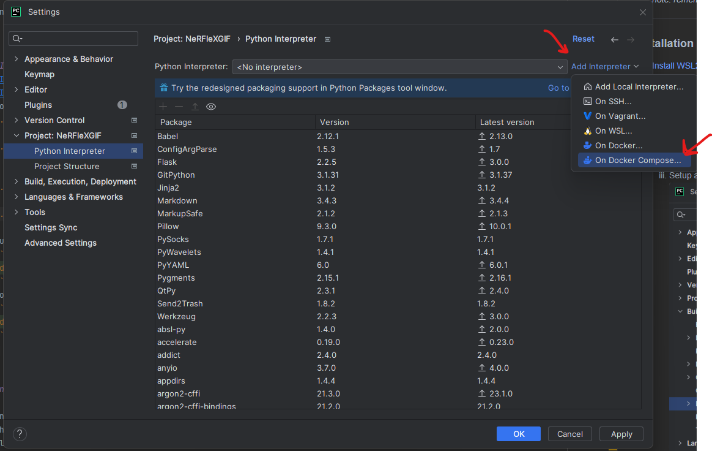
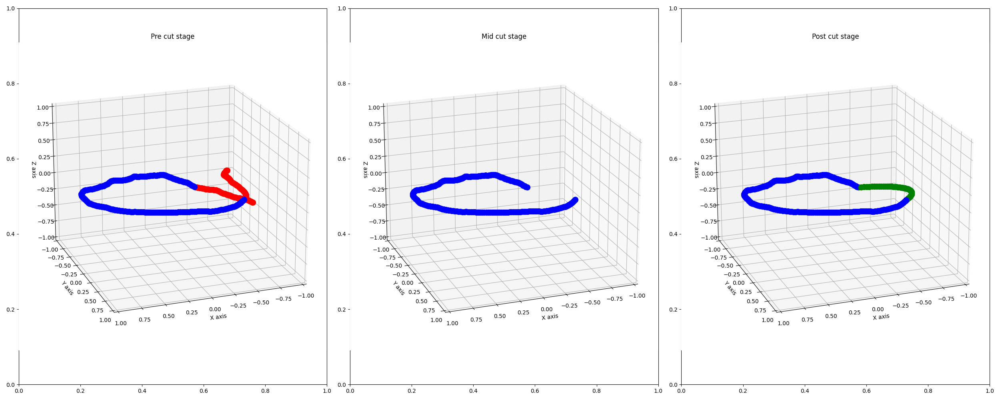

# NeRFlexGIF

___
In this project, we employed NerfStudio's NeRF framework as a seamless black-box implementation of NeRF technology. Our
aim was to craft flawless circular GIF images from captured videos, achieving a visually captivating result.
___

<!-- TOC -->
* [NeRFlexGIF](#nerflexgif)
  * [Installation steps](#installation-steps)
    * [Prerequisites:](#prerequisites)
      * [Requirements:](#requirements)
    * [Installation process:](#installation-process)
  * [Introduction](#introduction)
  * [Preliminaries](#preliminaries)
    * [NeRF](#nerf)
    * [Camera Extrinsic](#camera-extrinsic)
    * [Cubic Splines](#cubic-splines)
  * [The Algorithm](#the-algorithm)
    * [Cut Point Identification](#cut-point-identification)
    * [Connecting endpoints:](#connecting-endpoints)
    * [Spline sample rate](#spline-sample-rate)
    * [Generating New Frames](#generating-new-frames)
      * [Step 1.](#step-1)
      * [Step 2.](#step-2)
    * [Results](#results)
      * [Chair](#chair)
      * [Vase](#vase)
<!-- TOC -->

## Installation steps

### Prerequisites:

Any machine with the ability to run docker should suffice.

Throughout this project we've used wsl2 backend+docker desktop for windows. Hence, we will be covering this installation
path.

#### Requirements:

1. Windows OS with wsl2 support.

2. A CUDA capable GPU, see if your GPU is supported [here](https://developer.nvidia.com/cuda-gpus).

   _note: remember the Compute Capability of your GPU, will be needed later on._

___

### Installation process:

1. [Install WSL2 with Ubuntu 22.04](https://linuxconfig.org/ubuntu-22-04-on-wsl-windows-subsystem-for-linux)
2. [Install Docker Desktop](https://docs.docker.com/desktop/install/windows-install/)
3. For debugging:
    1. Edit the provided [env file](.env):
        1. Edit CUDA_ARCHITECTURES to fit for compute capability, e.g. for RTX 30x0 series, CUDA_ARCHITECTURES=86.
    2. Inside [docker-compose.yaml](docker-compose.yml):
        1. Edit mounted volumes under 'volumes:' so that it matches the absolute path mapping from the host machine to
           the
           container (do not edit the container part).
    3. Setup a listener on the docker socket:
        1. 
        2. Connection successful should appear when connected, otherwise, try troubleshooting your docker desktop
           software.
    4. Create a remote interpreter based on the docker-compose.yml:
        1. 
        2. Keep pressing next:

            
        3. Verify that your python script's run configuration has the docker interpreter:
           

4. Run from cmd line:
    ```bash
    docker run --gpus all -v C:\Users\lizas\PycharmProjects\NeRFleXGIF:/workspace/ -v C:\Users\lizas\PycharmProjects\NeRFleXGIF\.cache:/home/user/.cache/ -p 7007:7007 --rm -it --ipc=host dromni/nerfstudio:0.3.2 "python main.py [ARGS]"
    ```
   For help:
    ```bash
    docker run --gpus all -v C:\Users\lizas\PycharmProjects\NeRFleXGIF:/workspace/ -v C:\Users\lizas\PycharmProjects\NeRFleXGIF\.cache:/home/user/.cache/ -p 7007:7007 --rm -it --ipc=host dromni/nerfstudio:0.3.2 "python main.py --help"
    ```

---

## Introduction

Our objective is to create captivating GIFs from static scene videos provided by users. To achieve this, we employ NeRF
technology to seamlessly align the video's starting and ending frames.

The video alignment process involves the removal and generation of frames. We strategically cut frames based on their
camera extrinsic properties within the video. Additionally, we craft a well-defined route through interpolation
techniques and generate new camera extrinsic data accordingly.

Leveraging these camera extrinsic details, we employ our meticulously trained NeRF model to generate new frames. The
result is a flawlessly rendered video that captivates and engages the audience.

## Preliminaries

### NeRF

NeRF, which stands for Neural Radiance Fields, is a cutting-edge computer graphics and computer vision technique
introduced in 2020. It's a neural network-based approach that learns to create highly detailed and realistic 3D scenes
from 2D images. NeRF achieves this by modeling a 3D scene as a continuous function that maps 3D coordinates to color and
opacity values. It takes multiple 2D images of a scene captured from different viewpoints and learns to estimate the
scene's appearance and geometry, allowing for the synthesis of new views of the scene. NeRF has applications in virtual
reality, augmented reality, and 3D scene reconstruction, among others, due to its ability to generate lifelike 3D scenes
from limited image data.

### Camera Extrinsic

The camera extrinsics typically consist of the following components:

1. **Translation Vector (T)**: This vector represents the 3D coordinates of the camera's optical center (also known as
   the camera center) relative to the world coordinate system. It indicates how far the camera is displaced along the x,
   y, and z axes from the origin of the world coordinate system.

2. **Rotation Matrix (R)**: The rotation matrix describes the orientation of the camera in space. It specifies how the
   camera is rotated around each of the coordinate axes (roll, pitch, and yaw). The rotation matrix allows us to
   transform points from the camera's coordinate system to the world coordinate system.

Together, the translation vector (T) and the rotation matrix (R) provide a transformation that maps points from the
world coordinate system into the camera's coordinate system. This transformation is essential for understanding the
camera's viewpoint and perspective when capturing an image or video.

### Cubic Splines

Cubic splines are a mathematical interpolation technique used to create smooth curves or surfaces by connecting a series
of data points with piecewise cubic polynomials. They ensure continuity in both the function's value and its first
derivative at each data point, resulting in a smooth and visually pleasing curve or surface.

## The Algorithm

To make a perfect circular GIF from the video, we need to remove frames from the beginning and end of the video. Then,
we create new frames that follow a path from the end of the video back to the beginning at these cut points.

As NeRF primarily analyzes the scene from a limited set of frames, the synthesized images generated from new camera
positions should closely resemble the originals. If a new position deviates significantly from the original camera's
path, it can lead to the creation of less aesthetically pleasing images.

Let's break down the algorithm into simple steps:

1. Identify the appropriate start and end frames for cutting.
2. Create a smooth path connecting the new endpoint to the new starting point.
3. Determine the number of frames to be synthesized along this path.
4. Synthesize new frames along the path, given the amount of frames.
5. Finally, Merge all frames into a GIF image.

### Cut Point Identification

To cut the video optimally, we want to minimize the following loss function:

```math
cost(s, f) = \left| \sum_{i = s}^{f - 1} \frac{\frac{|z_{i + 1} - z_{i}|}{\alpha_{i}}}{f - s} - \frac{|z_{f} - z_{s}|}{\alpha}\right|
```

where:

* calculation of the angle between to vectors is:
  $ \arccos (\hat{v_1} \cdot \hat{v_2}) $
* $\alpha$ is the angle between start and end point vectors, when projected to the xy plain.
* $\alpha_{i} is the angle between the points i and i+1 after projection to xy plain.

The core idea here is to retain a consistent steepness in the z-height when transitioning from the newly cut end point
to the newly cut starting point. This approach ensures that the frame synthesis process produces a gradual and visually
pleasing result for the human eye. To accomplish this, we focus on preserving the proportion of the average z-height as
we move from the endpoint (where the video was cut) to the starting point (which is also a newly cut starting point)
relative to the z-distance already traveled after the cut. By following this method, we guarantee that the transition
between the new start and end points maintains a similar "z-speed" and smoothness compared to the speed from the end to
the start points. In other words, the lower the score obtained through this process, the smoother the z-height
transitions will be. Our approach involves systematically checking pairs of frames (X% points from the start and the
end, we chose 20% as X%.), taken from the start and end edges, to find the minimal score that results in the desired
transition.
___

### Connecting endpoints:

To create a smooth connection between the new endpoints, we've employed cubic splines to generate a polynomial path that
extends from the endpoint to the starting point.

Regarding the positions of the camera origins, which are newly placed to generate the new frames, we've utilized a
straightforward linear interpolation method to determine the translation (position) vector. This determination is based
on its relative position along the path.

When it comes to the directions, we've adopted the "look-at" camera model. This model defines the extrinsic camera
orientation through orthogonal forward, up, and right vectors, which uniquely represent the camera's perspective. In the
transitional frames, we've conducted linear interpolation for the forward and up vectors accordingly, and obtained the
right vector by taking the cross product of the forward and up vectors at each step.
___

### Spline sample rate

After determining the remaining number of frames following the cut, we can estimate that the number of generated frames
is proportionate to the number of frames in the complementary $\alpha$ section after the cut. This computation can be
expressed as follows:

```math
\#generated\_frames = \#frames\_after\_cut \cdot \frac{\alpha}{2\pi - \alpha} 
```

___

### Generating New Frames

In order to generate new frames, we construct a 3D cubic spline from the start and end points, by parametrizing a 3d
curve:

```math
\vec{s(t)}=(x(t), y(t), z(t)), 0 \leq t \leq \frac{\#generated\_frames}{fps}
```

where s(t) is a spline over the x,y,z axes as a function of t respectively,
and where time at step i := $t_i = \frac{i}{fps}$

The generation of the new frames are split into 2 steps:

1. Generation of "key" frames.
2. Generation of intermediary frames in between "key" frames.

#### Step 1.

From empirical evidence, we've concluded that the number of "key" frames should be calculated according to the following
formula:

```python
samples_percentile = 0.3 if num_generated_frames > 30 else 0.5
number_of_key_frames = num_generated_frames * samples_percentile
```

#### Step 2.

Calculation of intermediary frames are done with an interpolation function provided by NerfStudio, see
documentation [here](https://docs.nerf.studio/reference/api/cameras.html#nerfstudio.cameras.camera_utils.get_interpolated_poses_many).

Note: this could also be done with sampling **all** the frames from our Spline class as well.
___

### Results

We've run our algorithm on 3 datasets, one original dataset provided by NerfStudio, and two "field" datasets that we took from a 
Pixel 3a smartphone (30~ fps), we'll produce the results for the field datasets.

#### Chair dataset
Chair cut stages:



#### Vase dataset
Vase cut stages:


Vase NerFlexGIF:


---
Special thanks to [Simon Korman](https://scholar.google.com/citations?user=6OZMoP0AAAAJ&hl=en) for supervising this project!